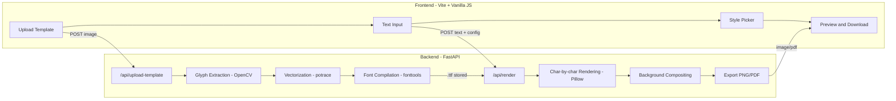

# AI Handwriting Generator — Implementation Plan

Based on the [mvp.md](file:///d:/Coolshit/mvp.md) specification. This plan covers Option A (custom font from glyphs) with a Python backend and a modern web frontend.

---

## User Review Required

> [!IMPORTANT]
> **Frontend framework choice**: This plan uses a **Vite + vanilla JS** frontend for speed. If you'd prefer React/Next.js, let me know before I start.

> [!IMPORTANT]
> **Hosting decision**: The plan assumes local development first. We'll need to decide on a deployment target (Vercel + Railway, Fly.io, etc.) before Week 5.

> [!WARNING]
> **FontForge vs pure fonttools**: FontForge has built-in autotrace support but is harder to install on Windows. This plan uses the **pure Python path** (`potrace` CLI + `fonttools`) to avoid that dependency. This means you'll need the `potrace` binary installed (`winget install potrace` or download from http://potrace.sourceforge.net).

## Open Questions

1. **Auth provider** — Do you want a full auth system (email+password via Supabase/Firebase) or a simpler session-based approach for MVP?
2. **Storage** — Local filesystem for MVP, or wire up S3/Cloudflare R2 from the start?
3. **Character set** — The plan assumes A-Z uppercase, a-z lowercase, 0-9, and ~15 punctuation symbols (. , ! ? ' " - : ; ( ) @ # & $). Want to add/remove anything?
4. **Paper backgrounds** — Want me to generate 2-3 paper texture images (lined notebook, blank parchment, grid paper), or do you have assets?

---

## Architecture Overview



---

## Proposed Changes

### Project Structure

```
d:/Coolshit/
├── backend/
│   ├── main.py                  # FastAPI app entry point
│   ├── requirements.txt
│   ├── config.py                # Settings, paths, constants
│   ├── routers/
│   │   ├── template.py          # /api/upload-template, /api/template-status
│   │   └── render.py            # /api/render, /api/export
│   ├── services/
│   │   ├── extractor.py         # OpenCV glyph extraction
│   │   ├── vectorizer.py        # potrace bitmap to SVG paths
│   │   ├── font_builder.py      # fonttools TTF compilation
│   │   └── renderer.py          # Pillow character-by-char rendering
│   ├── models/
│   │   └── schemas.py           # Pydantic request/response models
│   ├── assets/
│   │   ├── template.pdf         # Printable capture template
│   │   ├── template_reference.json  # Grid coordinates for extraction
│   │   └── backgrounds/         # Paper texture images
│   │       ├── lined.png
│   │       ├── blank.png
│   │       └── grid.png
│   └── storage/                 # User uploads, fonts, renders (gitignored)
│       ├── uploads/
│       ├── glyphs/
│       ├── fonts/
│       └── renders/
├── frontend/
│   ├── index.html
│   ├── style.css
│   ├── main.js
│   ├── pages/
│   │   ├── upload.js            # Template upload flow
│   │   ├── editor.js            # Text input + style picker
│   │   └── preview.js           # Result preview + download
│   └── assets/
│       └── template.pdf         # Downloadable capture template
└── README.md
```

---

### Component 1: Capture Template Design

#### [NEW] `backend/assets/template.pdf`
A printable A4/Letter page with:
- **4 corner alignment markers** (filled black squares) for perspective correction
- **Grid of character boxes** (~80 boxes): A-Z, a-z, 0-9, punctuation
- Each box: 1cm x 1cm inner writing area, 2mm padding, thin border
- Labels printed below each box (the expected character)
- Instruction header: "Write each character clearly inside its box using a dark pen"

#### [NEW] `backend/assets/template_reference.json`
JSON mapping of each box's expected position relative to alignment markers:
```json
{
  "page_size": [2480, 3508],
  "markers": [[100, 100], [2380, 100], [100, 3408], [2380, 3408]],
  "cells": [
    {"char": "A", "row": 0, "col": 0, "x": 200, "y": 400, "w": 120, "h": 120},
    {"char": "B", "row": 0, "col": 1, "x": 340, "y": 400, "w": 120, "h": 120}
  ]
}
```

---

### Component 2: Glyph Extraction Pipeline

#### [NEW] `backend/services/extractor.py`

**Input**: Uploaded photo/scan of filled template
**Output**: Directory of cropped, cleaned glyph images (one PNG per character)

Pipeline steps:
1. **Load and grayscale** — `cv2.imread` then `cv2.cvtColor(GRAY)`
2. **Detect alignment markers** — threshold + contour detection to find the 4 corner squares
3. **Perspective warp** — `cv2.getPerspectiveTransform` + `cv2.warpPerspective` to flatten skew/rotation using the 4 markers mapped to the reference coordinates
4. **Cell extraction** — Using `template_reference.json`, crop each cell at its known coordinates
5. **Cleanup per glyph**:
   - Adaptive threshold (`cv2.adaptiveThreshold`) to binarize
   - Remove grid lines via morphological operations (horizontal/vertical kernels + `cv2.morphologyEx`)
   - Find character contour then `cv2.boundingRect` then tight crop
   - Pad to square, resize to uniform size (e.g., 256x256)
6. **Validation** — Check each glyph has sufficient ink (non-white pixels above threshold); flag empty/poor cells for "redo" feedback
7. **Save** — `storage/glyphs/{session_id}/{char}.png`

Key OpenCV functions: `findContours`, `boundingRect`, `adaptiveThreshold`, `morphologyEx`, `getPerspectiveTransform`, `warpPerspective`

---

### Component 3: Vectorization

#### [NEW] `backend/services/vectorizer.py`

**Input**: Cleaned glyph PNGs
**Output**: SVG path data per character

Pipeline:
1. Convert glyph PNG to BMP (potrace input format)
2. Call `potrace` CLI via `subprocess`: `potrace glyph.bmp -b svg -o glyph.svg`
3. Parse the SVG output to extract path `d` attribute data
4. Normalize/scale paths to font coordinate space (typically 1000 or 2048 units-per-em)
5. **Alternative path**: Use `pypotrace` Python bindings if available, to avoid subprocess calls

---

### Component 4: Font Compilation

#### [NEW] `backend/services/font_builder.py`

**Input**: SVG path data for all characters
**Output**: `.ttf` font file

Using `fonttools`:
1. Create a new `TTFont` with required tables: `cmap`, `glyf`, `head`, `hhea`, `hmtx`, `loca`, `maxp`, `name`, `post`, `OS/2`
2. Parse SVG path strings via `fonttools.svgLib.path.SVGPath` then draw onto a `T2CharStringPen` or `TTGlyphPen`
3. Map each glyph to its Unicode codepoint (e.g., `A` maps to `U+0041`)
4. Set reasonable advance widths per glyph (based on bounding box width + padding)
5. Add basic kerning if feasible (optional for MVP)
6. Compile and save to `storage/fonts/{session_id}/handwriting.ttf`

---

### Component 5: Rendering Engine

#### [NEW] `backend/services/renderer.py`

**Input**: Text string, font path, rendering config (paper style, pen color, jitter params)
**Output**: PNG and/or PDF of rendered handwriting

This is the core "magic" component. Character-by-character rendering with randomization:

```python
# Pseudocode for the rendering loop
for each line in wrapped_text:
    x = left_margin
    y = current_baseline
    for each char in line:
        # Load char as image from font
        char_img = render_single_char(char, font, size)

        # Apply per-character randomization
        rotation = random.gauss(0, 2.5)        # plus/minus 2-5 degree subtle tilt
        x_jitter = random.gauss(0, 1.5)        # horizontal wobble
        y_jitter = random.gauss(0, 1.0)        # baseline wobble
        size_scale = random.uniform(0.95, 1.05) # slight size variation
        spacing_var = random.gauss(0, 1.0)      # letter spacing variation

        # Transform and paste
        char_img = char_img.rotate(rotation, expand=True)
        char_img = char_img.resize(scaled_size)
        canvas.paste(char_img, (x + x_jitter, y + y_jitter), mask=char_img)

        x += char_advance + spacing_var
```

Additional rendering features:
- **Text wrapping** — auto-wrap at page width with configurable margins
- **Line spacing** — configurable, with slight per-line vertical jitter
- **Ink color** — user-selectable (default: dark blue `#1a1a6b`, black, dark gray)
- **Ink opacity variation** — slight per-character alpha variation (0.85-1.0) to simulate pressure differences
- **Background compositing** — paste rendered text layer onto selected paper texture
- **PDF export** — use `Pillow` for PNG, `reportlab` or `img2pdf` for PDF wrapping

---

### Component 6: FastAPI Backend

#### [NEW] `backend/main.py`
- FastAPI app with CORS middleware (allow frontend origin)
- Mount static files for template PDF
- Include routers

#### [NEW] `backend/routers/template.py`

| Endpoint | Method | Description |
|---|---|---|
| `/api/template/download` | GET | Serve the printable capture template PDF |
| `/api/template/upload` | POST | Accept template photo, kick off extraction pipeline |
| `/api/template/status/{session_id}` | GET | Check extraction status, return per-character quality report |
| `/api/template/redo/{session_id}` | POST | Re-upload specific characters that failed validation |

#### [NEW] `backend/routers/render.py`

| Endpoint | Method | Description |
|---|---|---|
| `/api/render` | POST | Accept text + config, return rendered image |
| `/api/render/preview` | POST | Quick lower-res preview for the editor |
| `/api/export/{render_id}` | GET | Download final PNG or PDF |

#### [NEW] `backend/models/schemas.py`
Pydantic models for:
- `TemplateUploadResponse` — session_id, extraction status, character quality map
- `RenderRequest` — text, session_id (which font to use), paper_style, pen_color, jitter_intensity
- `RenderResponse` — render_id, preview_url, download_url

#### [NEW] `backend/config.py`
- Storage paths, allowed file types, max upload size
- Rendering defaults (jitter ranges, font size, margins)
- Character set definition

#### [NEW] `backend/requirements.txt`
```
fastapi>=0.110.0
uvicorn[standard]>=0.29.0
python-multipart>=0.0.9
opencv-python-headless>=4.9.0
numpy>=1.26.0
Pillow>=10.3.0
fonttools>=4.50.0
img2pdf>=0.5.0
python-magic>=0.4.27
aiofiles>=23.2.0
```

---

### Component 7: Frontend

#### [NEW] `frontend/index.html`
Single-page app shell with:
- Step-based wizard UI (Upload, Edit, Preview)
- Dark mode glassmorphism aesthetic
- Google Font: Inter for UI, plus dynamic loading of user's generated font for preview

#### [NEW] `frontend/style.css`
Design system with:
- CSS custom properties for theming (dark/light)
- Glassmorphic card components (backdrop-filter, subtle borders)
- Gradient accent colors (warm amber to coral palette)
- Smooth page transitions between wizard steps
- Responsive layout (mobile-friendly but web-first)
- Micro-animations on interactive elements

#### [NEW] `frontend/main.js`
Core app logic:
- Step router (hash-based navigation between upload/editor/preview)
- File upload with drag-and-drop + progress indicator
- Fetch calls to backend API
- Image preview rendering

#### [NEW] `frontend/pages/upload.js`
- Download template button (links to backend PDF)
- Drag-and-drop upload zone with visual feedback
- Upload progress bar
- Post-upload: show extraction results — grid of detected glyphs with quality indicators (good, needs redo)
- "Redo" flow for failed characters

#### [NEW] `frontend/pages/editor.js`
- Large textarea for text input (or paste)
- Sidebar controls:
  - Paper style picker (thumbnail cards: lined, blank, grid)
  - Pen color picker (preset swatches + custom)
  - Jitter intensity slider (subtle to chaotic)
- "Generate Preview" button

#### [NEW] `frontend/pages/preview.js`
- Full-size rendered image display
- Download buttons: PNG, PDF
- "Edit" button to go back to editor
- "New Text" to render something else with same font

---

## Verification Plan

### Automated Tests
```bash
# Unit tests for the core pipeline
pytest backend/tests/ -v

# Test cases:
# - Glyph extraction on a reference template image
# - Vectorization produces valid SVG paths
# - Font compilation produces a valid TTF (can be loaded by Pillow)
# - Renderer produces correct-dimension images
# - API endpoints return expected status codes
```

### Manual Verification
1. **Template round-trip** — Print template, fill it in by hand, photograph with phone, upload and verify all 80 characters extracted cleanly
2. **Font quality** — Open generated `.ttf` in a system font viewer, confirm glyphs match handwriting
3. **Rendering realism** — Generate several paragraphs, visually compare against real handwriting. Tune jitter params until it passes the "squint test"
4. **Edge cases** — Test with: blurry photo, skewed scan, missing characters, very long text, special characters not in template
5. **Cross-browser** — Test frontend in Chrome, Firefox, Safari
6. **Mobile upload** — Test photo upload from phone camera (the most common capture method)

---

## Implementation Order (mapped to MVP phases)

| Phase | Duration | Deliverable |
|---|---|---|
| **Phase 1** | Week 1-2 | Template PDF + extraction pipeline + backend skeleton |
| **Phase 2** | Week 3 | Vectorization + font compilation pipeline |
| **Phase 3** | Week 4 | Rendering engine with jitter + paper backgrounds |
| **Phase 4** | Week 5 | Frontend UI + end-to-end integration + export |
| **Phase 5** | Week 6 | Real-user testing, jitter tuning, polish, error handling |

---

## Risk Mitigations

| Risk | Mitigation |
|---|---|
| Bad scans break extraction | Guided capture UI with tips; alignment markers for auto-correction; per-character quality scoring with redo flow |
| Repetitive characters look fake | Gaussian jitter on rotation/position/size/spacing; optional: capture 2 variants per common letter (e, t, a, o) in v1.1 |
| Missing characters in template | Fallback to a default handwriting-style font for unmapped characters; show warning to user |
| potrace not installed | Ship a pre-built binary or use `pypotrace` wheel; document install steps clearly |
| Large images slow the pipeline | Resize uploaded template to max 3000px wide before processing; async processing with status polling |
